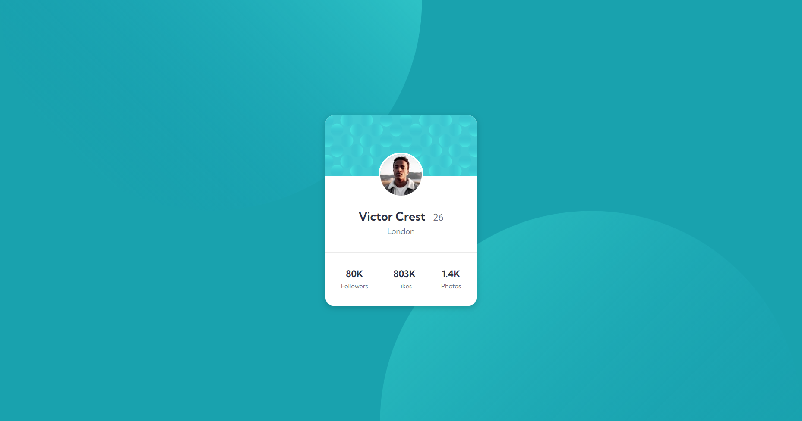

# Frontend Mentor - Profile card component solution

This is a solution to the [Profile card component challenge on Frontend Mentor](https://www.frontendmentor.io/challenges/profile-card-component-cfArpWshJ). Frontend Mentor challenges help you improve your coding skills by building realistic projects. 

## Table of contents

- [Overview](#overview)
  - [The challenge](#the-challenge)
  - [Screenshot](#screenshot)
  - [Links](#links)
- [My process](#my-process)
  - [Built with](#built-with)
  - [What I learned](#what-i-learned)

## Overview

### The challenge

- Build out the project to the designs provided

### Screenshot

### Links

- [Solution URL](https://github.com/jma26/profile-card-FE-Mentor-4)
- [Live Site URL](https://jma26.github.io/profile-card-FE-Mentor-4/)

## My process

### Built with

- HTML5
- CSS
- Flexbox
- CSS Grid
- Mobile-first workflow

### What I learned

There were a couple CSS properties I learned more about! I did not know you could manipulate the background position to to achieve what I needed in the desktop, mobile-preview. In addition, I found out I've been relying a lot on `div` tags for layout instead of HTML5 semantics. I thought about the semantics and decided that I should be really using semantic tags like `article`, `header`.